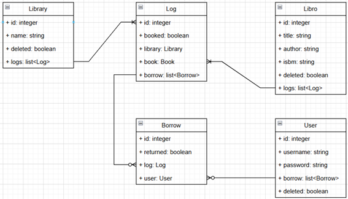

# Gestor de Bibliotecas
## Descripción del problema

El proyecto pedido se trata de crear una WebApp capaz de gestionar una biblioteca. En ella usuarios asistirán a realizar reservas y/o devolver libros. Para cada biblioteca se le debe poder añadir y quitar libros.  
Además, cada biblioteca debe poder mostrar sus libros disponibles y los usuarios deben poder consultarlo.

Como extras:
-	Tiene que poder gestionar múltiples usuarios
-	Cada usuario debe poder ver su registro de reservas
-	Evitar que el usuario pueda reservar el mismo libro 2 veces.

La WebApp debe ser desarrollada en Java haciendo uso de SpringBoot. Además, se deben incluir pruebas a las diferentes capas que incluyan un alto grado de covertura.

## Análisis
### Análisis de Requisitos
#### Libros:
-	Se tiene que poder crear, consultar, actualizar y eliminar libros. 
#### Bibliotecas:
-	Se tiene que poder crear, consultar, actualizar y eliminar bibliotecas. 
-	Se tiene que poder añadir y quitar libros de una biblioteca. 
-	Tiene que poder mostrar todos los libros disponibles de una biblioteca. 
#### Usuarios:
-	Se tiene que poder crear, consultar, actualizar y eliminar usuarios. 
-	Se tiene que poder reservar y devolver libros de una biblioteca. 
-	Tiene que poder ver todos los libros disponibles de una biblioteca. 
-	No puede reservar el mismo libro dos veces. 
-	Tiene que poder ver su historial de préstamos. 
### Análisis técnico
#### UML

#### Arquitectura
Como arquitectura principal se ha usado una de 3 capas:
-	**Capa de presentación**: En esta se controlan las plantillas de thymleaf. En realidad, podría estar dentro de la capa de negocio, pero me gusta verlo el actualizar las plantillas como llamadas a un api. Siendo esta las que abren paso a la capa de negocio. 
-	**Capa de negocio**: Servicio que procesa las peticiones que manda el controlador.
-	**Capa de persistencia**: Repositorio donde se realizan las operaciones en la base de datos.
Para poder incorporar esta estructura de 3 capas se ha usado el patrón ***MVC*** para abarcar la arquitectura mencionada anteriormente.
## Tecnologías usadas
| Tecnología         | Descripción                                                                              |
|--------------------|------------------------------------------------------------------------------------------|
| JAVA               | V .17                                                                                    |
| Intellij IDEA      | Entorno de desarrollo                                                                    |
| Spring Boot        | V.3.4.4                                                                                  |
| H2                 | Base de datos                                                                            |
| Junit y Mockito    | Para la realización de los tests                                                         |
| GitHub             | Repositorio del código y gestión de versiones                                            |
| Lombok             | Permite el uso de anotaciones permitiendo generar código más limpio                      |
| Thymeleaf          | Para la generación de plantillas                                                         |
| Drawio             | Para la creación del UML                                                                 |
